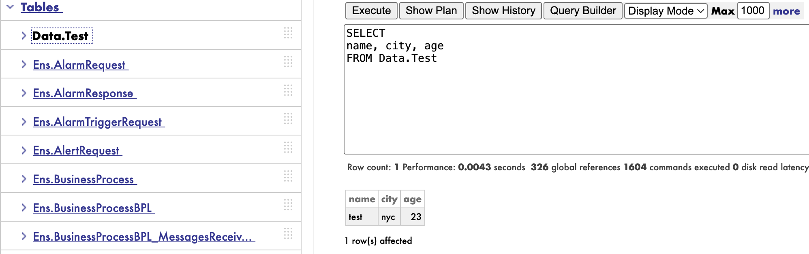
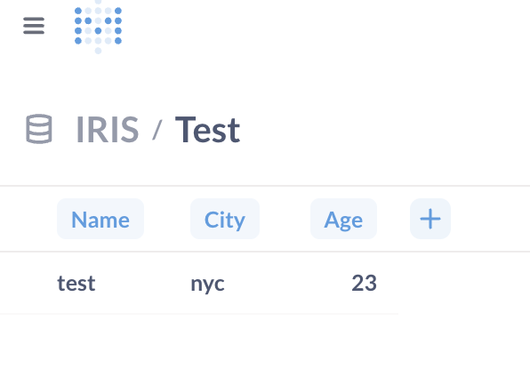

# Metabase IRIS Driver

A custom driver for connecting Metabase to InterSystems IRIS databases. This driver enables Metabase to query, analyze, and visualize data from IRIS databases using the native IRIS JDBC driver.

Here's a video demo: https://youtu.be/yoaQBg331M4

## Table of Contents
- [Quick Start (Docker)](#quick-start-docker)
- [Building Driver Locally](#building-driver-locally)
- [Development Process](#development-process)
- [Contributing](#contributing)
- [License](#license)

## Quick Start (Docker)

**NOTE:** If you are following this guide on a Windows machine, you would need to change the iris image in the `docker-compose.yaml` file.
```
# docker/docker-compose.yaml

image: containers.intersystems.com/intersystems/irishealth-community-arm64:latest-preview # Change this line

image: containers.intersystems.com/intersystems/irishealth-community:latest-preview # To this 
``` 

This Quick Start guide is fully contained and comes with a Metabase instance, an IRIS instance and automatically injects the driver for you. If you have your own IRIS/Metabase instance that you want to test the driver on, simply remove the appropriate services in the `docker-compose.yaml` file (see [here](#components-and-configurations) for more details) or download the latest driver from the [releases page](https://github.com/Siddardar/metabase-iris-driver/releases) of this repo and use it accordingly. A guide to using community drivers in Metabase can be found [here](https://www.metabase.com/docs/latest/developers-guide/community-drivers). 

For this guide, Docker as well as some basic understanding of IRIS is needed. 

1. **Clone this repository and navigate to the docker folder**
   ```bash
   git clone <repository-url>

   cd metabase-iris-driver/docker
   ```
2. **Start with docker compose**:
   ```bash
   docker compose up -d
   ```

3. **The following containers will start spinning up**:
   
   - `metabase`: Contains the Metabase instance and listens at port 3000
   - `setup`: Runs the `setup.sh` script once the metabase container is healthy which creates an admin account with the default credentials
   - `iris`: Contains the IRIS instance and listens at ports 52773 (Web Server Port) and 1972 (Superserver Port)
   - `iris-setup`: Runs the `iris-setup.sh` script once the `iris` container is healthy to change the default password to _sys_. 

   Both the `setup` and `iris-setup` containers will spin down once the respective scripts have finished running. These containers are simply for convinience and do not impact the functionality of the driver in any way. 

4. **Add some sample data in IRIS**. To keep things simple we are going to add one table with some data to the _USER_ namespace. Execute the following queries:
   ```SQL
   CREATE TABLE Data.Test (
      name varchar(20), 
      city varchar(3), 
      age int
   )
   ```

   ```SQL
   INSERT INTO Data.Test (name, city, age) VALUES ('test', 'nyc', 23)
   ```
   <details>
   <summary> Now you should have a table that looks something like this: </summary>
   <br>

   

   </details>

   <br>

3. **Navigate to Metabase** The default URL is `localhost:3000` 

4. **Login using the default credentials**: 
   ```
   Username: admin@metabase.local
   Password: Metapass123
   ```

5. **In the side panel, click on** `Add a database`

6. **Enter the following information**:
   ```bash
   Database type: Intersystems IRIS
   Display name: IRIS                # Feel free to choose whatever you want
   Host: iris                        # ONLY if the IRIS instance is running in a container called iris
   Superserver Port: 1972            # To check navigate to the IRIS Management Portal > About
   Namespace: USER                   # The namespace you want to connect to
   Username: _SYSTEM                 # The user you want to connect as
   Password: sys                     # Password of the above user

   ```
   And press `Save`

7. **Metabase will start syncing table data from IRIS**. Once it is done, navigate to `localhost:3000/browse/databases` and view the tables

   <details>
   <summary> You should see this: </summary>
   <br>

   

   </details>


### Components and Configurations
This method consists of three components which are easily modifiable to your specific needs. 

1. `docker-compose.yaml`

   This simple docker compose file defines four containers `metabase`, `setup`, `iris` and `iris-setup`.

   - `metabase`

      Initalises a Metabase instance with a volume defined at `./metabase-data` and injects the driver to the appropriate `/plugins` folder as required in the container. 
      
      Parameters:

      ```bash
      ports: <port of your host>:<port inside container> # Maps host port to container port

      environment.MB_JDBC_DATA_WAREHOUSE_MAX_CONNECTION_POOL_SIZE # Defines the maximum pool size from Metabase to IRIS. Max: 25 (Depending on IRIS license)

      volumes # Ensures data is kept beyond the lifetime of a container and injects the driver. NOTE: for the driver to work, it has to be placed in the /plugins folder in the container (this is handled by the 2nd volume instruction)

      healthcheck # Runs a curl command in the container to ensure that the Metabase instance is running. The setup container is dependent on this healthcheck  
      ``` 
   
   - `setup` (Optional): See below for more information

   - `iris`

      Initalises an IRIS instance with a volume defined at `./iris-data`

      Parameters:
      ```bash
      ports: <port of your host>:<port inside container> # Maps host port to container port. For IRIS you need to map both the Web Server Port and Superserver Port

      environment # Username and password of the default admin user

      volumes # Ensures IRIS data is kept beyond the lifetime of a container

      healthcheck # Opens an iris terminal session and runs a pwd command to ensure the IRIS instance is running. The iris-setup container is dependent on this healthcheck
      ```

   - `iris-setup` (Optional): See below for more information


2. `setup.sh`

   This bash file is used in the `setup` container to create an admin account which works by making `curl` requests to the Metabase API. For more information refer to the [Metabase API docs](https://www.metabase.com/learn/metabase-basics/administration/administration-and-operation/metabase-api) 

   Parameters:
   ```bash
   ADMIN_EMAIL
   ADMIN_PASSWORD
   METABASE_HOST # Depends on the name of the metabase container in the docker compose file
   METABASE_PORT # Depends on the docker compose file

   # NOTE: You can choose to change these variables by editing this file or through the entrypoint variable in the setup container definition
   ```

3. `iris-setup.sh`

   Similar to `setup.sh`, this bash script helps with the password change that is required when you log into IRIS for the first time. 

   Parameters:
   ```bash
   URL           # Management Portal URL of the IRIS instance 
   NEW_PASSWORD  
   ```
   
## Building Driver Locally

This section outlines the steps one would need to take to build the driver locally in the event any changes to the functionality of the driver is required. All commands below assume you’re working on macOS. Wherever applicable, you’ll find links documenting equivalent instructions for other operating systems.

### Prerequisites for Building


1. **Install Clojure CLI:** https://clojure.org/guides/install_clojure
   ```bash
   brew install clojure/tools/clojure
   ```
   

2. **Clone Metabase** (for building within Metabase context):
   ```bash
   git clone https://github.com/metabase/metabase.git

   cd metabase
   ```

### Build Steps

1. **Copy the driver files to Metabase:**
   ```bash
   cp -r /path/to/metabase-iris-driver/iris-jdbc modules/drivers/
   ```

2. **Edit the `modules/drivers/deps.edn` file to include the iris-jdbc driver in the dependancy list:**
   ```bash
   metabase/iris-jdbc          {:local/root "iris-jdbc"}
   ```

3. **Make the necessary edits. See [Development Process](#development-process) for more information**

4. **Build the driver:**
   ```bash
   clojure -X:build:drivers:build/driver :driver :iris-jdbc
   ```

5. **Locate the built JAR:**
   ```bash
   ls resources/modules/iris-jdbc.metabase-driver.jar
   ```

6. **Use the driver**
   ```bash
   ~
   ├── metabase.jar                   
   ├── plugins
       └── iris-jdbc.metabase-driver.jar   
   ```
   Place the driver in the `/plugins` folder (create the folder if you haven't) next to the metabase.jar file and restart your Metabase instance. Alternatively if you're using following the quick guide and using docker, simply replace the existing driver file and restart the Metabase container.

## Development Process
This section attempts to outline the development process I took in order to build this driver. Do note that this is not a exhaustive guide but rather an introductory alternative to the Metabase docs which may be confusing for someone who has never worked on a driver or Clojure before. Additionally, as Metabase is a product that is constantly changing, there is no guarentee that this process will continue to work in the future. 

### Structure of driver

All Metabase drivers follow the follwing structure:
```bash
iris-jdbc
├── deps.edn                   # Dependancy file
├── resources
│   └── metabase-plugin.yaml   # Driver metadata
└── src
    └── metabase
        └── driver
            └── iris_jdbc.clj  # Main driver code
```
- `deps.edn`
   
   Paths define all the folders in the `iris-jdbc` folder you want to include when compiling the driver. If one wanted to add additional Clojure logic in a `utils` folder, for example, and reference them in the main driver code, then you would need to add the `utils` folder here as well. 

   This file also defines all the dependancies needed to run the driver. At a minimum, one would need the Intersystems JDBC driver hosted on the [Maven Repository](https://mvnrepository.com/artifact/com.intersystems/intersystems-jdbc). 
   
   You also need define the parent of this driver to be the sql-jdbc driver. In this case since we already have an existing IRIS JDBC driver that we want to use, we can simply let the provided sql-jdbc driver do most of the heavy lifting for us and only change specific methods that are needed. Without this, you would need to implement all the sql-jdbc methods by youself.

- `resources/metabase-plugin.yaml`

   This file contains all the metadata of the driver such as the name and the inputs the user needs to provide in order to sucessfully connect to an IRIS instance. Under the `driver` and `info` sections, you are able to customise what the user sees and provide additional options for more advanced configurations. Do look at the yaml files for other drivers for inspiration

   **NOTE**:
   The `merge` property under `connection-properties` takes the default metadata for a particular connection property and overrides certain features of it to make more sense. 

   The `init` section tells Metabase where your driver is located and the name of the driver in a particular JDBC. As such, when changing the name of the folder from `iris-jdbc`, it is important to make sure that the change is propogated throughout the 3 components where needed as well as the root `deps.edn` file


- `src/metabase/driver/iris_jdbc.clj`

   This is the main Clojure code that makes up the driver. Most of the heavy lifting is done by the provided generic `sql-jdbc` driver and you would need to investigate to figure out which methods you would need to overwrite for your DB and use case. Start by importing the functions that you need before registering the driver with the DeviceManager. Following that you need to define the features that IRIS supports as well as define the type mappings from Java to Metabase. These Java types are what the IRIS JDBC returns in the form of a ResultSet. 

   For convinience I have included the docstrings of all the available methods in the `driver-docs.txt` file. More information can be found [here](https://www.metabase.com/docs/latest/developers-guide/drivers/multimethods#listing-the-available-driver-multimethods) and on the [Metabase Github repository](https://github.com/metabase/metabase/tree/master/src/metabase/driver/sql_jdbc).  
   
   #### Must implement mutimethods 
   For any driver, there are two main methods that you must define: `jdbc-spec` which defines how a connection string to your database is constructed from the inputs given by the user (defined by `manifest-plugin.yaml`) and `sql-jdbc.conn/connection-details->spec` which transforms the generic Metabase DB definition into the parameters for `clojure.java.jdbc` which is needed to open a connection. Technically since `jdbc-spec` is just a helper method, you could write all the logic in `sql-jdbc.conn/connection-details->spec` but doing this way seems cleaner. 

   #### Holdability
   Next are `sql-jdbc.execute/statement` and `sql-jdbc.execute/prepared-statement`. Metabase by default expects database to support holdability over `HOLD_CURSORS_ON_COMMIT` and `CLOSE_CURSORS_ON_COMMIT`. In this case since IRIS only supports holdability over `HOLD_CURORS_ON_COMMIT`, a temporary workaround is to add these functions to disable holdablility all together. 

   #### Unsupported SQL
   Often, different databases will have their own dialects of SQL which aren't universal. For example, `SELECT TRUE ...` while completely acceptable in Postgres and MySQL does not work in IRIS. Hence you would need to discover the methods that Metabase is calling and override them. In this case, `sql-jdbc.sync/fallback-metadata-query` and `sql-jdbc.sync/have-select-privilege?` needed to be overriden so that `SELECT TRUE` could be rewritten to `SELECT 1` instead. 

   In general unless you have a very good understanding of the underlying database and the functions Metabase calls, it's nearly impossible to know what methods you would need to override. One way is to simply implement the barebones version of a driver and monitor the logs for the function that is not working. Slowly overriding functions from there will eventually lead you to having a functioning driver with the least lines of code. 

   #### Removing system schemas and tables
   Metabase simply syncs with all available schemas and tables it can find my default. To prevent Metabase from doing this, one of two methods can be used depending on the number of system tables your database contains. 
   
   1. Override `sql-jdbc.sync/excluded-schemas` (Easy)

      The method expects a set of strings as a return value and as such you need to simply provide a set of set of schema strings that you want to exclude. This is useful if the number of system tables being imported is small and remain constant across database instances. 
      ```Clojure
      (defmethod sql-jdbc.sync/excluded-schemas :iris-jdbc [_]
         #{"Ens"})
      ```

      NOTE: Regex cannot be used in this method. Metabase simply does an exact string matching to decide if a schema is excluded or not. 

   2. Override `sync.interface/filtered-syncable-schemas` (My method)

      Overriding this function allows you to dynamically remove schemas by iterating through the all the schemas Metabase fetches and removing schemas that start with or are equal to a string. This prevents the issue of maintaining a large list of excluded schemas which is especially useful if all the system schemas begin with a certain prefix as it is in the case of IRIS. 

      The full implementation is in the driver code but the main idea is this method, by default, fetches all the available schemas, excludes the schemas in `sql-jdbc.sync/excluded-schemas` and returns a set of schemas. Since we need to use the default implementation of this function to get a set of all schemas, we first need to save the original implementation in a seperate function before overriding this function. This allows us to call the original implementation in our overriden function giving us the full list of schemas that we can then filter. 


   #### Other definitions

   There are also DateTime and miscellenious function definitions in the driver. Although I believe that they aren't strictly necessary for importing data into Metabase, I simply followed other jdbc drivers as they had implemented them. 


## Contributing

Contributions are welcome! Take a look at the issues tracker for ideas!

### Development Guidelines

- Follow Clojure coding conventions
- Add docstrings to public functions
- Test with multiple IRIS versions if possible
- Update documentation for new features

## License

This project is licensed under the MIT License. See the LICENSE file for details.

---

**Note**: This driver is not officially supported by Metabase yet and as such will not work on Metabase Cloud. 
